**Software AI Engineer · Applied AI & Automation**

I build practical AI systems and reliable automations that turn complex information into useful workflows.

📍 São Paulo, Brazil

## Selected work

### [TradutorIA](https://github.com/maxsampa/TradutorIA)

Streamlit application that uses BLOOM 560M to refine Portuguese text before translating it into English, Spanish or French with googletrans.

`Python` `Streamlit` `Transformers` `PyTorch`

[View source](https://github.com/maxsampa/TradutorIA)
· [Open app](https://tradutoria-bloom.streamlit.app/)

### [Speech Processing Lab](https://github.com/maxsampa/asr-pipeline)

Experiments in Portuguese audio preprocessing, feature extraction and transcription with Whisper. Includes a commented Wav2Vec2 implementation.

`Python` `Librosa` `Whisper` `Transformers` `scikit-learn`

[View source](https://github.com/maxsampa/asr-pipeline)

### Production work (under NDA)

Automated intelligence and reporting pipeline built with Python, external APIs and persistent history, running on a fixed schedule with fault isolation and optional AI-assisted analysis. Client and domain are confidential.

<!-- PREENCHER: 2 ou 3 números anonimizados. Exemplos do formato:
     "Processes ~N sources per run, weekly, unattended since <mês/ano>."
     "Replaced a manual review step that previously took ~N hours per week."
     Sem número, esta seção continua sendo uma afirmação sem prova. -->

## Technical toolkit

| Area | Tools |
| --- | --- |
| LLMs & NLP | OpenAI API, Hugging Face Transformers, PyTorch |
| Data & automation | Python, APIs, Pandas, SQLite |
| Delivery | GitHub Actions, Streamlit, scheduled pipelines |

## Contact

Open to collaborating on applied AI, intelligent automation and data-driven products.

[LinkedIn](https://www.linkedin.com/in/fabio-a-ribeiro/) <!-- PREENCHER: e-mail profissional -->

---

External counter provided by Komarev; not a count of unique visitors or recruiter visits.
